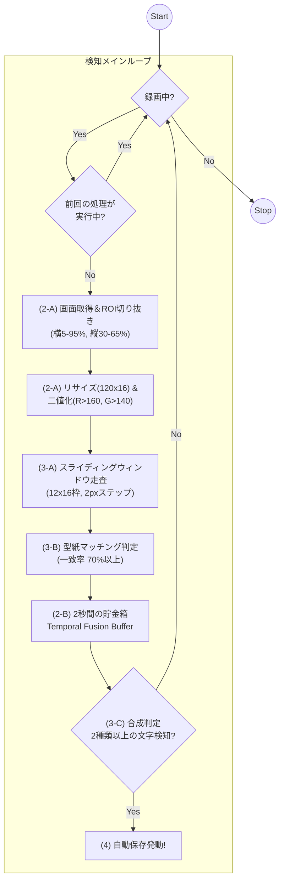

# WIPEOUT 自動検知システム 技術仕様書 (Ver 7.0.0)

WIPEOUT演出の激しい明滅、色の変化、およびキャラクターの重なりを克服しつつ、スマホの負荷を最小限に抑えた「現場叩き上げ」の検知システムについて定義する。

## 1. 概要
本システムは、単一フレームの解析に依存せず、過去2秒間に得られた断片的な文字情報を統合（Temporal Fusion）し、論理的な綴りを再構成することで WIPEOUT を確定させる。
Ver 7.0.0 では、**「ピクセルマッチング・スライディングウィンドウ方式」**を採用し、OCRエンジンに頼らない低コストかつ高耐性な文字検知を実現している。

## 2. 解析パイプライン

### A. 全体フロー：安定動作と高速検知

### B. 時空間フラグメント・バッファ (Temporal Fusion)
検出された文字情報を以下のデータセットとして **2,000ms（2秒間）** 保持する。
キャラクター被り等で一部の文字が隠れても、時間軸上で蓄積されたフラグメントを合成することで確定を行う。
-   `Timestamp`: 検出時刻
-   `DetectedChar`: 正規化後の文字（'W','I','P','E','O','U','T'）

## 3. 検知・救済アルゴリズム

### A. スライディングウィンドウによる文字走査
ROIをリサイズした120x16pxの画像に対し、横12x縦16pxの窓をスライドさせて文字を探索する。
-   **走査ステップ**: 2pxずつ右へ移動。
-   **重複検知防止**: 一致率70%以上の文字を検知した場合、その位置からさらに6px進めて次の走査を行う。

### B. 型紙マッチング判定
窓内のピクセルデータと、あらかじめ定義された「W, I, P, E, O, U, T」の各型紙を比較する。
-   **二値化基準**: `R > 160` かつ `G > 140` であれば文字(1)、それ以外は背景(0)。
-   **合格ライン**: 窓内の二値化データと型紙の一致率が **70% 以上** であれば、その文字を検知したとみなす。

型紙の考え方
端末の画面想定　2400×1080
縦をWIPEOUTの文字分の35%だけ切り抜き　2400×378
縦を16pxになるように縮小　23.625割り　102×16

横2400の文字位置
| 文字 | 中心X座標 | 理想幅 |
| **W** | 348px | 520px |
| **I** | 714px | 225px |
| **P** | 1031px | 305px|
| **E** | 1319px | 305px |
| **O** | 1679px | 280px |
| **U** | 2038px | 270px |
| **T** | 2248px | 300px |

横102の場合 23.53割り
| 文字 | 中心X座標 | 理想幅 |
| **W** | 11px | 23px |
| **I** | 30px | 6px |
| **P** | 44px | 16px|
| **E** | 56px | 14px |
| **O** | 71px | 14px |
| **U** | 87px | 14px |
| **T** | 96px | 15px |

### C. シーケンシャル合成判定
全7文字（W, I, P, E, O, U, T）のうち、バッファ内で **2種類以上** の文字が検知された瞬間にWIPEOUTを確定させる。これにより、一時的なエフェクトやキャラクターによる文字欠けがあっても、時間軸上の合成で誤検知を防ぐ。

## 4. 録画エンジンとバッファ管理
（※既存のセグメント回転、高速マージ（FastMerge）仕様は維持）
-   **10枚結合アトラス**: デバッグ用画像は10枚分を1枚に結合して保存。I/O負荷を軽減。

## 5. 実装状況と今後の課題

| 項目 | 状況 | 備考 |
| :--- | :--- | :--- |
| **検知方式** | ピクセルマッチング | 高速かつスマホ負荷が低い |
| **耐久性** | 高い | スライディングウィンドウ＋時間軸合成によるキャラ被り対策 |
| **今後の課題** | 文字型紙の微調整 | さらなる背景ノイズ耐性の強化 |
