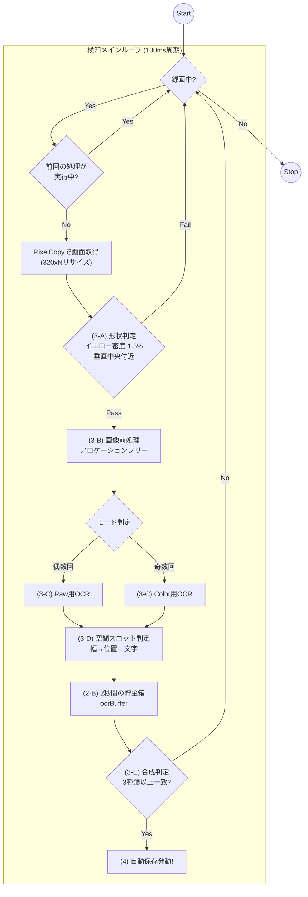

# WIPEOUT 自動検知システム 技術仕様書 (Ver 6.5.0)

WIPEOUT演出の激しい明滅、色の変化、およびキャラクターの重なりを克服しつつ、スマホの負荷を最小限に抑えた「現場叩き上げ」の検知システムについて定義する。

## 1. 概要
本システムは、単一フレームの解析に依存せず、過去2秒間に得られた断片的な文字情報を統合（Fusion）し、論理的な綴りを再構成することで WIPEOUT を確定させる。
特に Ver 6.5.0 では、**「ツインOCRエンジン」**による低負荷動作と、**「空間スロット制」**による誤認識救済（回転・反転対応）を核としている。

## 2. 解析パイプライン

### A. 全体フロー：安定動作と高速検知

### B. 時空間フラグメント・バッファ (Temporal Fusion)
検出された文字情報を以下のデータセットとして **2,000ms（2秒間）** 保持する。
-   `Timestamp`: 検出時刻
-   `Text`: 正規化後の文字（'W','I','P','E','O','U','T'のいずれか）
-   `CenterX`: 画面横方向の中心座標
-   `Width`: 検出された文字の幅

## 3. 検知・救済アルゴリズム

### A. 判定の門番: 形状判定 (checkShapeFast)
OCRを実行する前に、低コストな画像解析によって「黄色い塊」があるかを判定する。
-   **垂直範囲**: 画面中央（高さ30%〜70%）を走査。
-   **閾値**: 走査エリア内のイエロー画素密度が **1.5%以上**。
これを満たした場合のみ、重いOCR処理へ移行する。

### B. 超軽量・安定化設計 (Optimization)
-   **ツインOCRエンジン**: 「RAW用」「COLOR用」の2つのインスタンスを常駐させ、モード切り替え時のエンジン再起動（ModifyGraph）による高負荷とログ出力を排除。
-   **アロケーションフリー**: 画像処理に使う `IntArray` や `Bitmap` をメンバー変数で再利用。毎秒10回のメモリ確保をなくし、GCによるカクつきを防止。

### C. マルチモード解析
100msごとに、以下の処理を交互に繰り返す。
1.  **RAWモード**: カラー画像をそのまま解析。
2.  **COLORモード**: 黄色成分のみを抽出したグレー画像を解析。

### D. 空間スロット判定 ＆ 三段階フィルタリング (isSpatialMatch)
「幅（粗い目）→ 位置 → 文字（細かい目）」の順でノイズをふるい落とす。

| 手順 | 項目 | 条件 | 目的 |
| :--- | :--- | :--- | :--- |
| **①** | **幅 (Size)** | 各スロットの理想幅に対し **50%以上** | 小さなノイズやゴミを最速で排除 |
| **②** | **位置 (Position)** | 規定のスロット座標 **±25px** 以内 | 正しい文字並びの場所にあるか確認 |
| **③** | **文字種 (Char)** | 正規化・許容セットに含まれるか | OCRの「なまり」を救済 |

#### スロット定義詳細 (200px幅換算)
判定に使用する具体的な設計値は以下の通り。

| スロット | 本来の文字 | 中心X座標 | 理想幅 | 許容文字セット (正規化対象) |
| :--- | :---: | :---: | :---: | :--- |
| Slot 0 | **W** | 28px | 36px | W, V, M |
| Slot 1 | **I** | 55px | 10px | I, 1, \|, L |
| Slot 2 | **P** | 78px | 24px | P, F, B, I |
| Slot 3 | **E** | 105px | 22px | E, L, F, 3 |
| Slot 4 | **O** | 132px | 24px | O, 0, Q, D |
| Slot 5 | **U** | 162px | 24px | U, V, L, J |
| Slot 6 | **T** | 185px | 22px | T, I, L |

#### 文字正規化（救済）の定義
演出による欠けや、ノイズによる回転・反転を考慮し、位置が合っていれば本来の文字として受理する。
*   **回転・反転対応**: 'T' の欠けを逆さまの **'L'** と読んでも、スロット6なら 'T' とみなす。'W' の反転を **'M'** と読んでもスロット0なら受理する。
*   **形状類推**: 'E' の崩れを **'3'** と読んでも、正しいスロットなら受理。

### E. シーケンシャル合成判定
バッファ内に蓄積されたユニークな正規化文字が **3種類以上** 揃った瞬間に検知を確定させる。異なるフレームで拾った断片を合体させるパズル方式。
*   **保持期間**: 検出から **2,000ms (2秒間)**
*   **確定閾値**: ユニークな正規化文字種数 **>= 2**

## 4. 録画エンジンとバッファ管理
（※既存のセグメント回転、高速マージ（FastMerge）仕様は Ver 4.0 から継続）
-   **10枚結合アトラス**: デバッグ用画像は10枚分を1枚に結合して保存。I/O負荷を軽減。

## 5. 実装状況と今後の課題

| 項目 | 状況 | 備考 |
| :--- | :--- | :--- |
| **クラッシュ対策** | 解決済み | ツインエンジン ＆ 再利用化により安定 |
| **回転・反転救済** | 実装済み | スロット方式により 'L' などの誤読を救済 |
| **検出精度** | 良好 | 現場ログに基づき X座標±25px / 幅50%に調整済み |
