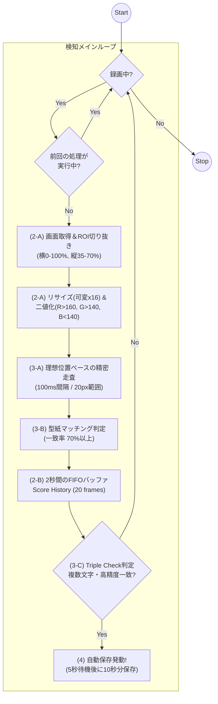

# WIPEOUT 自動検知システム 技術仕様書 (Ver 7.0.0)

WIPEOUT演出の激しい明滅、色の変化、およびキャラクターの重なりを克服しつつ、スマホの負荷を最小限に抑えた「現場叩き上げ」の検知システムについて定義する。

## 1. 概要
本システムは、単一フレームの解析に依存せず、過去2秒間に得られた断片的な文字情報を統合（Temporal Fusion）し、論理的な綴りを再構成することで WIPEOUT を確定させる。
Ver 7.0.0 では、**「ピクセルマッチング・スライディングウィンドウ方式」**を採用し、OCRエンジンに頼らない低コストかつ高耐性な文字検知を実現している。

## 2. 解析パイプライン

### A. 全体フロー：安定動作と高速検知

### B. 時空間フラグメント・バッファ (Score History)
検出された文字ごとの最高スコアを **直近20フレーム（約2秒間）** 保持する。
キャラクター被り等で一部の文字が隠れても、時間軸上で得られた最大値を統合することで確定を行う。
-   **バッファ容量**: 20フレーム分
-   **統合ルール**: 履歴内の各文字ごとの「最大スコア」を算出

## 3. 検知・救済アルゴリズム

### A. 理想位置ベースの精密走査
ROIをリサイズ（高さ16px固定）した画像に対し、各文字の理想的な出現位置（102px基準）を中心に20pxの範囲をスキャンする。
-   **探索範囲**: 理想的な左端座標から -10px 〜 +10px の範囲。
-   **スキャン**: 1px刻みで型紙と照合し、最高スコアをそのフレームの代表値とする。

### B. 型紙マッチング判定
窓内のピクセルデータと、文字ごとに定義された「W, I, P, E, O, U, T」の型紙を比較する。
-   **二値化基準**: `R > 160` かつ `G > 140` かつ `B < 140` であれば文字(1)、それ以外は背景(0)。
-   **合格ライン**: 個別の文字検知としては **70% 以上** を基準とするが、最終判定はTriple Checkで行う。
-   **品質保証 (30%ガード)**: 背景との一致を含めて70%以上であっても、文字部分（白ピクセル）そのものの一致率が **30% 未満** の場合はスコアを 0 とする。

型紙の考え方（102px基準の理想位置）
| 文字 | 中心X座標 | 型紙幅 |
| :--- | :--- | :--- |
| **W** | 11px | 17px |
| **I** | 30px | 6px |
| **P** | 44px | 14px |
| **E** | 56px | 14px |
| **O** | 71px | 14px |
| **U** | 87px | 14px |
| **T** | 96px | 11px |

### C. Triple Check (最終判定ロジック)
バッファ内の最大スコア群に対し、以下の3条件を全て満たした場合にWIPEOUTと確定させる。
1.  **高精度一致**: 「80%以上が1文字以上」または「75%以上が2文字以上」
2.  **複数文字検知**: 「70%以上が3文字以上」
3.  **最低品質保証**: 「全7文字が50%以上」

## 4. 録画エンジンとバッファ管理
### A. セグメント管理
-   **分割単位**: 60秒（1分）ごとにファイルをローテーション。
-   **保持上限**: `ceil(設定分 * 1.2)` 個。
    -   例: 6分設定なら8個、1分設定なら2個。
-   **向き(Orientation)管理**: 画面回転時にセグメントを強制更新。
    -   **解像度スワップ**: 設定解像度（720p等）を現在の向き（縦・横）に合わせて自動的に適用。
-   **保存時の選別ルール**: キャッシュ内の「横向き(_L)」と「縦向き(_P)」のファイル数を比較し、**数が多い方の向きのファイルのみを結合対象**とする。向きの異なるファイルは破棄される。
-   **セッションフィルタリング**: 現在の録画セッション開始時刻の2秒前以降に作成されたファイルのみを結合対象とする。
-   **クリーンアップ**: 新規録画開始時に、キャッシュディレクトリ内の古いセグメントファイルを全て強制削除する。

### B. 音声・システム制御
-   **音声キャプチャ**: Android 10(Q)以降の `AudioPlaybackCapture` を使用。
    -   **サンプリング**: 48,000Hz, 2ch (Stereo), 16bit PCM
    -   **エンコード**: AAC, 128kbps
-   **オーディオフォーカス**: 録音開始時に一時的（約0.5秒）に `AUDIOFOCUS_GAIN` を要求し、システム音キャプチャパスを活性化させる。
-   **通知の種類**: Android 10以上では `MEDIA_PROJECTION` および `MICROPHONE` のフォアグラウンドサービスタイプを明示的に要求する。
-   **広告表示タイミング**: 以下のタイミングでインタースティシャル広告をロード・表示する（デバッグビルドを除く）。
    1. アプリ前面復帰時 (`onResume`)
    2. 録画停止時 (`stopRecording`)

### C. 自動保存フロー
1.  WIPEOUT確定。
2.  フローティングボタンのテキストを `WO!` に変更し、透明度を 0.4 に下げる。
3.  **5秒間待機**（WIPEOUT演出の終了を待つ）。
4.  直近 **10秒分** のバッファを切り出して保存。
5.  **結合ギャップ**: ファイル結合時、再生の安定性のためにセグメント間に **1000μs (1ms)** のオフセットを挿入する。

### D. 診断・デバッグ機能
-   **HIT保存**: WIPEOUT確定時に診断用画像を保存。
-   **NEAR保存**: 確定に至らなくても、一定のしきい値（スコア0.7以上が2文字以上など）を超えた場合に「惜しい判定」として画像を保存する。

### E. ユーザーインターフェース (UI)
-   **移動しきい値**: フローティングボタンの移動判定には **10px** の遊び（しきい値）を設け、意図しない微細な移動を防止する。

## 5. 実装状況と今後の課題

| 項目 | 状況 | 備考 |
| :--- | :--- | :--- |
| **検知方式** | ピクセルマッチング | 高速かつスマホ負荷が低い |
| **耐久性** | 高い | スライディングウィンドウ＋時間軸合成によるキャラ被り対策 |
| **今後の課題** | 文字型紙の微調整 | さらなる背景ノイズ耐性の強化 |
