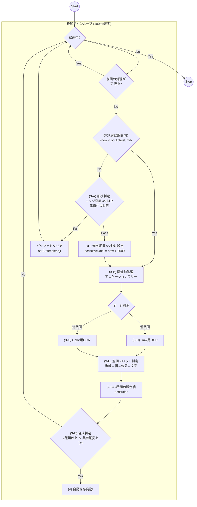

# WIPEOUT 自動検知システム 技術仕様書 (Ver 6.5.0)

WIPEOUT演出の激しい明滅、色の変化、およびキャラクターの重なりを克服しつつ、スマホの負荷を最小限に抑えた「現場叩き上げ」の検知システムについて定義する。

## 1. 概要
本システムは、単一フレームの解析に依存せず、過去2秒間に得られた断片的な文字情報を統合（Fusion）し、論理的な綴りを再構成することで WIPEOUT を確定させる。
特に Ver 6.5.0 では、**「ツインOCRエンジン」**による低負荷動作、ステート制御による**「OCRアクティブ期間（2秒間）の自動調整」**、および**「空間スロット制」**による誤認識救済（回転・反転対応）を核としている。

## 2. 解析パイプライン

### A. 全体フロー：安定動作と高速検知

### B. 時空間フラグメント・バッファ (Temporal Fusion)
検出された文字情報を以下のデータセットとして **2,000ms（2秒間）** 保持する。
-   `Timestamp`: 検出時刻
-   `Text` (`char`): 正規化後の文字（'W','I','P','E','O','U','T'のいずれか）
-   `rawChar`: 検出された生の文字
-   `CenterX`: 画面横方向の中心座標
-   `Width`: 検出された文字の幅
-   `Height`: 検出された文字の高さ

## 3. 検知・救済アルゴリズム

### A. 判定の門番: 形状判定 (checkContrastFast) ＆ アクティブ期間制御
OCRを実行する前に、低コストな画像解析によって「文字らしいコントラストの塊」があるかを判定する。また、一度検知したら一定期間OCRを継続させるステート制御を行う。

-   **判定方法 (checkContrastFast)**:
    -   **垂直走査範囲**: 画面中央付近（高さ30%〜70%）を走査。
    -   **輝度計算**: $L = 0.299R + 0.587G + 0.114B$ を用いて簡易的な輝度を計算。
    -   **判定基準**: 左右の隣接ピクセルとの輝度差が **30** を超える箇所をエッジとみなす。走査エリア内のエッジ密度が **4.0% 以上** の場合、形状判定に合格したとみなす。
-   **OCRアクティブ期間制御 (`ocrActiveUntil`)**:
    -   形状判定に合格すると、OCR有効期限を **2,000ms（2秒後）** にセットする。
    -   有効期限内であれば、形状判定（エッジ走査）をスキップ（または終了直前100ms以内のみ再走査）し、毎フレーム連続でOCRエンジンによる高精度解析を行う。
    -   有効期限が切れた場合は、蓄積バッファ（`ocrBuffer`）をクリアし、再び毎フレーム形状判定を実行する待機モードに戻る。

### B. 超軽量・安定化設計 (Optimization)
-   **ツインOCRエンジン**: 「RAW用」「COLOR用」の2つのインスタンスを常駐させ、モード切り替え時のエンジン再起動（ModifyGraph）による高負荷とログ出力を排除。
-   **アロケーションフリー**: 画像処理に使う `IntArray` や `Bitmap` をメンバー変数で再利用。毎秒10回のメモリ確保をなくし、GCによるカクつきを防止。

### C. マルチモード解析
100msごとに、以下の処理を交互に繰り返す。
1.  **RAWモード**: カラー画像をそのまま解析。
2.  **COLORモード**: 黄色成分のみを抽出したグレー画像を解析。

### D. 空間スロット判定 ＆ 三段階フィルタリング (isSpatialMatch)
「縦幅（粗い目）→ 幅（理想幅基準）→ 位置 → 文字種（細かい目）」の順でノイズをふるい落とす。

| 手順 | 項目 | 条件 | 目的 |
| :--- | :--- | :--- | :--- |
| **①** | **縦幅 (Height)** | 基準(37px)に対し **75%以上 (27px)** | 背景の小文字ノイズを物理サイズで排除 |
| **②** | **幅 (Size)** | 各スロットの理想幅に対し **Slot 1, 6 は 50%以上、他は 40%以上** | 小さなゴミや細長いノイズを排除 |
| **③** | **位置 (Position)** | 規定のスロット座標 **±20px** 以内 | 正しい文字並びの場所にあるか確認 |
| **④** | **文字種 (Char)** | 正規化・許容セットに含まれるか | OCRの「なまり」を救済 |

#### スロット定義詳細 (200px幅換算)
判定に使用する具体的な設計値は以下の通り。
※全文字共通の縦幅基準: **37px** (閾値75% = **27px**)

| スロット | 本来の文字 | 中心X座標 | 理想幅 | 許容文字セット (正規化対象) | 幅判定の閾値 |
| :--- | :---: | :---: | :---: | :--- | :---: |
| Slot 0 | **W** | 29.0px | 40.0px | W, V, M | 40% (>= 16px) |
| Slot 1 | **I** | 59.5px | 17.0px | I, 1, \|, L | 50% (>= 8.5px) |
| Slot 2 | **P** | 86.0px | 19.5px | P, F, B, I | 40% (>= 7.8px) |
| Slot 3 | **E** | 110.0px | 20.5px | E, L, F | 40% (>= 8.2px) |
| Slot 4 | **O** | 140.0px | 22.5px | O, 0, Q, D, C | 40% (>= 9px) |
| Slot 5 | **U** | 170.0px | 18.5px | U, V, L, J | 40% (>= 7.4px) |
| Slot 6 | **T** | 187.5px | 17.0px | T, I, L | 50% (>= 8.5px) |

#### 文字正規化（救済）の定義
演出による欠けや、ノイズによる回転・反転を考慮し、位置が合っていれば本来の文字として受理する。
*   **回転・反転対応**: 'T' の欠けを逆さまの **'L'** と読んでも、スロット6なら 'T' とみなす。'W' の反転を **'M'** と読んでもスロット0なら受理する。
*   **形状類推**: 'O' と 'C' の類似（Slot 4 での **'C'** 許容）など。

### E. シーケンシャル合成判定 (checkSpatioTemporalMatch)
バッファ内に蓄積されたユニークな正規化文字が **2種類以上** 揃い、かつ **アルファベット（A-Z）の明瞭な生文字の証拠** が存在した瞬間に検知を確定させる。異なるフレームで拾った断片を合体させるパズル方式。
*   **保持期間**: 検出から **2,000ms (2秒間)**
*   **確定閾値**: 
    1.  バッファ内のユニークな正規化文字種数 >= **2** 種類（例: 'W' と 'O' など）
    2.  バッファ内に、生の文字（`rawChar`）が `A`〜`Z` の範囲に含まれるフラグメントが1つ以上存在すること（英字の裏付けチェック）

## 4. 録画エンジンとバッファ管理
（※既存のセグメント回転、高速マージ（FastMerge）仕様は Ver 4.0 から継続）
-   **10枚結合アトラス**: デバッグ用画像は10枚分を1枚に結合して保存。I/O負荷を軽減。

## 5. 実装状況と今後の課題

| 項目 | 状況 | 備考 |
| :--- | :--- | :--- |
| **クラッシュ対策** | 解決済み | ツインエンジン ＆ 再利用化により安定 |
| **回転・反転救済** | 実装済み | スロット方式により 'L' などの誤読を救済 |
| **検出精度** | 良好 | 現場ログに基づき X座標±20px / 幅40〜50%に調整済み |
